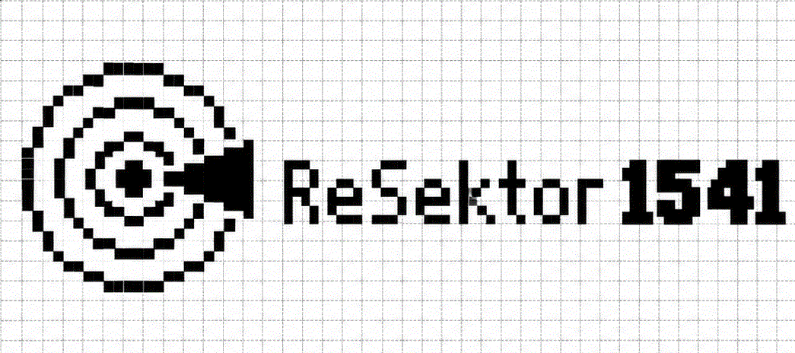

# ReSektor 1541
Občasník digitální archeologie psaný na počítači Commodore 64. Výstupní obrázky jsou tisknuty na virtuální tiskárně Ultimate64E2 pomocí ovladače EX-800 v3.5 s nastavením 240 DPI. Operační systém GDOS64 spolu s geoWriteCS, geoPublish a českými fonty od Marcuse.

[Volume 1](Volume%201/)
